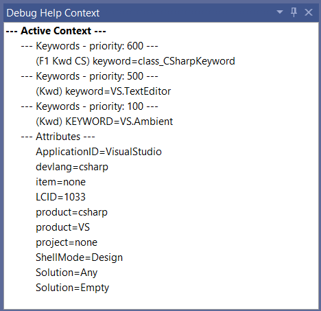

# Help Explorer for Visual Studio

Adds a tool window that shows the active debug help context. Can be used to troubleshoot extensions. 

Download and install the [CI build](https://www.vsixgallery.com/extension/ShowHelpContext.8ddc4ea8-5de7-49ac-947d-4c50ff2854a1/).

----------------------------------------------

Inspired by Ed Dore's [ShowDebugHelpContext extension](https://github.com/EdDore/VSXArcana/tree/master/ShowDebugHelpContext).

The tool window provides help context for the current open document, tool window and whatever is actively selected.

## License
[Apache 2.0](LICENSE)